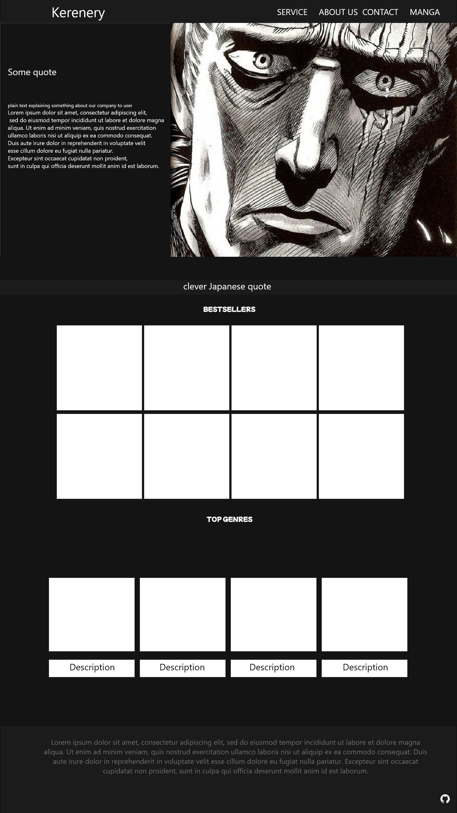

# Manga Store
### M33061 Kondratev Nickolay

A website to help you find manga you like. You can search for manga by name, author, genre, or even by the year it was published. You can also add manga to your favorites list, and see what other people think about it.
This web site is stylized as a manga itself, so you can feel like you are reading a manga while using it.

The point of creating this is that all the manga websites I've seen in Runet are just pagese of book stores, and I wanted to make something more like a social network for manga readers.

### Web pages templates

Main page

Manga list page

